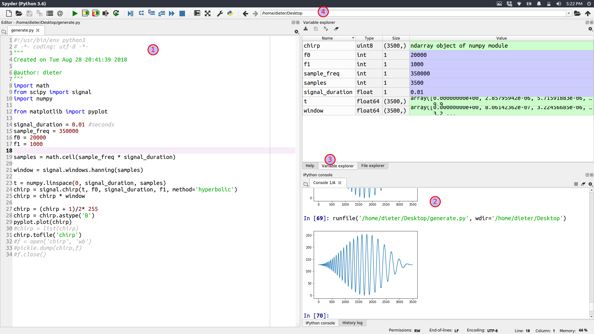

<h1>Table of Contents<span class="tocSkip"></span></h1>
<div class="toc"><ul class="toc-item"><li><span><a href="#Overview" data-toc-modified-id="Overview-1">Overview</a></span></li><li><span><a href="#Using-the-console" data-toc-modified-id="Using-the-console-2">Using the console</a></span><ul class="toc-item"><li><span><a href="#Elementary-Calculations" data-toc-modified-id="Elementary-Calculations-2.1">Elementary Calculations</a></span></li><li><span><a href="#Comparisons-and-Boolean-Logic" data-toc-modified-id="Comparisons-and-Boolean-Logic-2.2">Comparisons and Boolean Logic</a></span></li><li><span><a href="#Variable-assignment" data-toc-modified-id="Variable-assignment-2.3">Variable assignment</a></span><ul class="toc-item"><li><span><a href="#Numbers" data-toc-modified-id="Numbers-2.3.1">Numbers</a></span></li><li><span><a href="#Text" data-toc-modified-id="Text-2.3.2">Text</a></span></li><li><span><a href="#Boolean-value" data-toc-modified-id="Boolean-value-2.3.3">Boolean value</a></span></li></ul></li></ul></li><li><span><a href="#Basic-variable-types" data-toc-modified-id="Basic-variable-types-3">Basic variable types</a></span></li><li><span><a href="#Introduction-to-functions" data-toc-modified-id="Introduction-to-functions-4">Introduction to functions</a></span></li><li><span><a href="#Exercises" data-toc-modified-id="Exercises-5">Exercises</a></span><ul class="toc-item"><li><span><a href="#Exercise-1" data-toc-modified-id="Exercise-1-5.1">Exercise 1</a></span></li><li><span><a href="#Exercise-2" data-toc-modified-id="Exercise-2-5.2">Exercise 2</a></span></li><li><span><a href="#Exercise-3" data-toc-modified-id="Exercise-3-5.3">Exercise 3</a></span></li><li><span><a href="#Exercise-4" data-toc-modified-id="Exercise-4-5.4">Exercise 4</a></span></li><li><span><a href="#Exercise-5" data-toc-modified-id="Exercise-5-5.5">Exercise 5</a></span></li></ul></li></ul></div>

# Editor

## Overview

+ Why do we use Spyder?
+ The editor pane.
+ The iPython console.
+ Setting the working directory.



The image above shows the default layout of Spyder. If you ever mess up the layout and you wish to return to the default one, goto `view > window layouts > Spyder Default Layout`.

+ [1] This area is where we can edit Python files (files ending in `.py`). Python files are called *programs* or *scripts*. Python programs or scripts contain a bunch of code you can run by clicking the green arrow at the top of the screen.

+ [2] This is the console. Output of programs or scripts appears here. You can also type short code (called commands) and press enter. The code will be directly executed and any results will be displayed. The console is often used to test out pieces of code quickly.

+ [3] The Variable Explorer shows you the variables currently in Python's memory (you need to select the `Variable Explorer` tab to see it). The Variable Explorer gives you the name of the variable, its type and --for some types-- its value.

+ [4] In this field the current working directory is listed. This is the directory where Python will look for files to read by default. It is also the directory will store files by default. If Python complains about not finding a file, check whether the working directory is set correctly. **Note: when running a Python script or program using the green button, the working directory changes to the directory of the file that's being run.**

## Using the console

### Elementary Calculations

We can use the console to perform elementary operations.


```python
5+7
```


    12


```python
7/12
```


```python
(7/12) * 12
```


```python
7^2 #Bitwise XOR, not power as you might expect (see https://en.wikipedia.org/wiki/Bitwise_operation#XOR)
```


    5


```python
7 ** 2 #This is how you raise to the power
```


    49


### Comparisons and Boolean Logic

Python can also do comparisons:

+ \> Greater than
+ < Less than
+ == Equal to
+ != Not equal to
+ \>= Greater than or equal to
+ <= Less than or equal to

Python will determine whether a statement is True of False.


```python
(((17*3)/2)**2) * 1000 == ((3*1)**6) * 10
```


    False


```python
(((17*3)/2)**2) * 1000 != ((3*1)**6) * 10
```


    True


Python can also do Boolean logic:

+ and
+ or
+ not


```python
print (1==1 and 2==2)
print (1==1 or 1==2)
print (not(1==1 and 2==2))
```

    True
    True
    False


### Variable assignment

We can assign numbers to variables. This allows us to reuse them at at later stage.

#### Numbers


```python
a = 10
b = 30
print(a)
print(b)
a > b
```

    10
    30


    False


```python
a + b
```


    40


```python
a ** b
```

#### Text

Text can also be assigned to a variable.


```python
a = 'this is text'
```

#### Boolean value

Boolean values are either True or False.


```python
a = 2 > 1
a
```


```python
b = False
b
```


    False


## Basic variable types

Using the variable viewer in spyder, discuss (1) floats, (2) integers (3) strings and (4) boolean values.

## Introduction to functions

For now, introduce the concept of a function using the standard functions (not from a module). A list of standard functions can be found here:

https://docs.python.org/3/library/functions.html


```python
abs(-10)
```


    10


```python
round(10.4)
```


    10


```python
type(1)
```


    int


## Exercises

### Exercise 1 

1. Assign your name to a variable `my_name`.

+ Multiply the variable by 3. What happens?

+ Try adding 4 to `my_name`. What happens?

+ Assign the value `10` to a variable, for example `var1`. What is the type of this variable?

+ Divide `var1` by 2.5 and assign the result to `var2`. What is the type of var2?

+ Multiply `var2` by 2.5 and assign the result to `var3`. What is the type of `var3`?

+ What code assigns the value 10 to a variable named `my_value`?

+ Assign the value `10.5` to a variable. Round the variable and assign the result to a new variable.

### Exercise 2

Write code that assigns value 10 to variable `value1` and value 20 to `value2`. Test whether `value1` is larger than `value2`. Print out the result of the test.

### Exercise 3

When running the following code, what will be the type of variable `var1`?

```python
var1 = 10
```

Options: Float, Integer, Boolean, or String

### Exercise 4

 When running the following code, what will be the type of variable `var1`?

```python
var1 = 12.345
```

Options: Float, Integer, Boolean, or String

### Exercise 5

When running the following code, what will be the type of variable `var1`?

```python
var1 = 10 > var2
```

Options: Float, Integer, Boolean, or String
