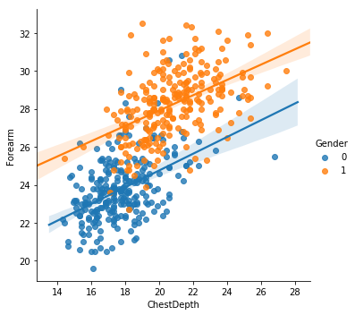
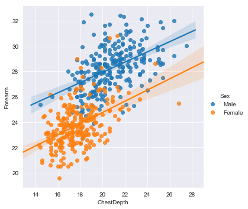
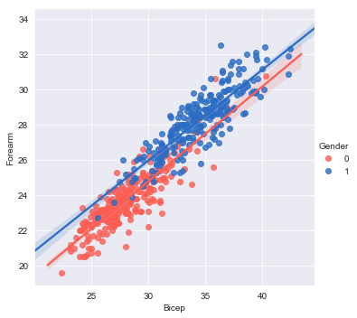
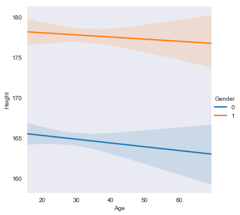
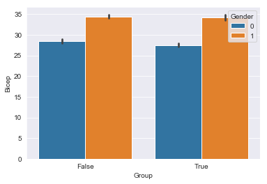
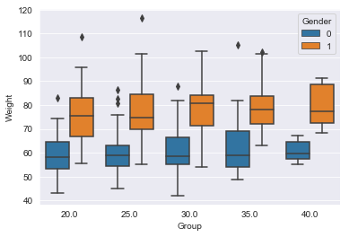
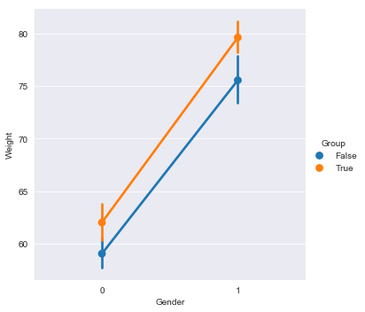
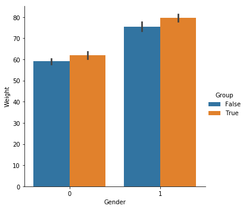

# Seaborn

The documentation of the functions can be found here: https://seaborn.pydata.org/api.html

Advantages:

+ Seaborn allows to plot a number of standard plots (often relevant in psychology) with minimal effort. Seaborn will calculate grouped averages, standard deviations and regression lines in the background.
+ Seaborn will label axes and legends using the labels in the data.

Disadvantages:

+ It is more difficult to fine-tune a Seaborn plot once it is plotted. The best approach is define styles, colors and labels *before* you create the plot.


```python
import pandas
import seaborn
from matplotlib import pyplot

data = pandas.read_csv('body.csv');
data.head()
```


<div>
<style scoped>
    .dataframe tbody tr th:only-of-type {
        vertical-align: middle;
    }

    .dataframe tbody tr th {
        vertical-align: top;
    }

    .dataframe thead th {
        text-align: right;
    }
</style>
<table border="1" class="dataframe">
  <thead>
    <tr style="text-align: right;">
      <th></th>
      <th>Biacromial</th>
      <th>Biiliac</th>
      <th>Bitrochanteric</th>
      <th>ChestDepth</th>
      <th>ChestDia</th>
      <th>ElbowDia</th>
      <th>WristDia</th>
      <th>KneeDia</th>
      <th>AnkleDia</th>
      <th>Shoulder</th>
      <th>...</th>
      <th>Bicep</th>
      <th>Forearm</th>
      <th>Knee</th>
      <th>Calf</th>
      <th>Ankle</th>
      <th>Wrist</th>
      <th>Age</th>
      <th>Weight</th>
      <th>Height</th>
      <th>Gender</th>
    </tr>
  </thead>
  <tbody>
    <tr>
      <th>0</th>
      <td>42.9</td>
      <td>26.0</td>
      <td>31.5</td>
      <td>17.7</td>
      <td>28.0</td>
      <td>13.1</td>
      <td>10.4</td>
      <td>18.8</td>
      <td>14.1</td>
      <td>106.2</td>
      <td>...</td>
      <td>32.5</td>
      <td>26.0</td>
      <td>34.5</td>
      <td>36.5</td>
      <td>23.5</td>
      <td>16.5</td>
      <td>21</td>
      <td>65.6</td>
      <td>174.0</td>
      <td>1</td>
    </tr>
    <tr>
      <th>1</th>
      <td>43.7</td>
      <td>28.5</td>
      <td>33.5</td>
      <td>16.9</td>
      <td>30.8</td>
      <td>14.0</td>
      <td>11.8</td>
      <td>20.6</td>
      <td>15.1</td>
      <td>110.5</td>
      <td>...</td>
      <td>34.4</td>
      <td>28.0</td>
      <td>36.5</td>
      <td>37.5</td>
      <td>24.5</td>
      <td>17.0</td>
      <td>23</td>
      <td>71.8</td>
      <td>175.3</td>
      <td>1</td>
    </tr>
    <tr>
      <th>2</th>
      <td>40.1</td>
      <td>28.2</td>
      <td>33.3</td>
      <td>20.9</td>
      <td>31.7</td>
      <td>13.9</td>
      <td>10.9</td>
      <td>19.7</td>
      <td>14.1</td>
      <td>115.1</td>
      <td>...</td>
      <td>33.4</td>
      <td>28.8</td>
      <td>37.0</td>
      <td>37.3</td>
      <td>21.9</td>
      <td>16.9</td>
      <td>28</td>
      <td>80.7</td>
      <td>193.5</td>
      <td>1</td>
    </tr>
    <tr>
      <th>3</th>
      <td>44.3</td>
      <td>29.9</td>
      <td>34.0</td>
      <td>18.4</td>
      <td>28.2</td>
      <td>13.9</td>
      <td>11.2</td>
      <td>20.9</td>
      <td>15.0</td>
      <td>104.5</td>
      <td>...</td>
      <td>31.0</td>
      <td>26.2</td>
      <td>37.0</td>
      <td>34.8</td>
      <td>23.0</td>
      <td>16.6</td>
      <td>23</td>
      <td>72.6</td>
      <td>186.5</td>
      <td>1</td>
    </tr>
    <tr>
      <th>4</th>
      <td>42.5</td>
      <td>29.9</td>
      <td>34.0</td>
      <td>21.5</td>
      <td>29.4</td>
      <td>15.2</td>
      <td>11.6</td>
      <td>20.7</td>
      <td>14.9</td>
      <td>107.5</td>
      <td>...</td>
      <td>32.0</td>
      <td>28.4</td>
      <td>37.7</td>
      <td>38.6</td>
      <td>24.4</td>
      <td>18.0</td>
      <td>22</td>
      <td>78.8</td>
      <td>187.2</td>
      <td>1</td>
    </tr>
  </tbody>
</table>
<p>5 rows × 25 columns</p>
</div>


## The linear model plot - aka the regression plot


```python
seaborn.lmplot(x='ChestDepth', y='Forearm', hue='Gender', data=data);
```





```python
data['Sex'] = 'Female'
data['Sex'][data.Gender==1] = 'Male'
```

    /home/dieter/anaconda3/envs/default/lib/python3.7/site-packages/ipykernel_launcher.py:2: SettingWithCopyWarning: 
    A value is trying to be set on a copy of a slice from a DataFrame
    
    See the caveats in the documentation: http://pandas.pydata.org/pandas-docs/stable/indexing.html#indexing-view-versus-copy
      


```python
seaborn.lmplot(x='ChestDepth', y='Forearm', hue='Sex', data=data);
```





## Colors

Seaborn provides a number of functions that allow specifying lists of colors (palettes) that will be used to plot data. See https://seaborn.pydata.org/api.html > Color Palettes.


```python
# https://en.wikipedia.org/wiki/List_of_Crayola_crayon_colors#Standard_colors
colors = ['Sunset Orange', 'Inchworm']
my_colors = seaborn.crayon_palette(colors)
seaborn.lmplot(x='Bicep', y='Forearm', hue='Gender', data=data, palette=my_colors);
```





## Trick: Showing a color palette


```python
seaborn.palplot(my_colors)
```


## Plot style

Seaborn has five built-in themes to style its plots: ```darkgrid```, ```whitegrid```, ```dark```, ```white```, and ```ticks```. Seaborn defaults to using the ```darkgrid``` theme for its plots.

You can select another theme for your plots and you can change the settings of a theme.


```python
seaborn.set_style('darkgrid')
seaborn.set_style('dark')
seaborn.lmplot(x='Age', y='Height', hue='Gender',scatter=False, data=data);
```





## Other types of plots

### The barplot

Seaborn makes it easy to plot complex barplots. This is more difficult in ```matplotlib.pyplot```.


```python
data['Group'] = data.Age < 25
seaborn.set_style('darkgrid')
seaborn.lmplot(x='Height', y='Bicep', hue='Gender', data=data);
```





### Boxplot: showing non-gaussian spread


```python
seaborn.boxplot(x='Group', y='Weight', hue='Gender', data=selection);
```





### Categorical plot


```python
data['Group'] = data.Age > 25
seaborn.catplot(x='Gender', y='Weight',hue='Group', data=data, kind='point');
```





```python
data['Group'] = data.Age > 25
seaborn.catplot(x='Gender', y='Weight',hue='Group', data=data, kind='bar');
```





```python

```
