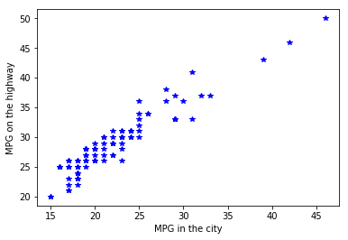
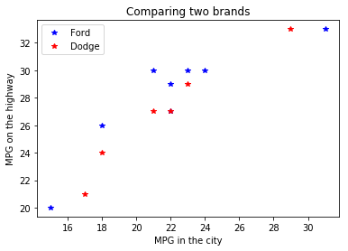

# Summary

## Reading data: the `read_csv()` function

This is the basic use of the `read_csv()` function:


```python
import pandas
data = pandas.read_csv('cars.txt', sep = ' ')
print(data.head())
```


<div>
<style scoped>
    .dataframe tbody tr th:only-of-type {
        vertical-align: middle;
    }

    .dataframe tbody tr th {
        vertical-align: top;
    }

    .dataframe thead th {
        text-align: right;
    }
</style>
<table border="1" class="dataframe">
  <thead>
    <tr style="text-align: right;">
      <th></th>
      <th>make</th>
      <th>model</th>
      <th>type</th>
      <th>min_price</th>
      <th>mid_price</th>
      <th>max_price</th>
      <th>mpg_city</th>
      <th>mpg_hgw</th>
      <th>airbag</th>
      <th>drive</th>
      <th>...</th>
      <th>tank</th>
      <th>passengers</th>
      <th>length</th>
      <th>wheelbase</th>
      <th>width</th>
      <th>uturn</th>
      <th>rearseat</th>
      <th>luggage</th>
      <th>weight</th>
      <th>domestic</th>
    </tr>
  </thead>
  <tbody>
    <tr>
      <th>0</th>
      <td>Acura</td>
      <td>Integra</td>
      <td>Small</td>
      <td>12.9</td>
      <td>15.9</td>
      <td>18.8</td>
      <td>25</td>
      <td>31</td>
      <td>0</td>
      <td>1</td>
      <td>...</td>
      <td>13.2</td>
      <td>5</td>
      <td>177</td>
      <td>102</td>
      <td>68</td>
      <td>37</td>
      <td>26.5</td>
      <td>11</td>
      <td>2705</td>
      <td>0</td>
    </tr>
    <tr>
      <th>1</th>
      <td>Acura</td>
      <td>Legend</td>
      <td>Midsize</td>
      <td>29.2</td>
      <td>33.9</td>
      <td>38.7</td>
      <td>18</td>
      <td>25</td>
      <td>2</td>
      <td>1</td>
      <td>...</td>
      <td>18.0</td>
      <td>5</td>
      <td>195</td>
      <td>115</td>
      <td>71</td>
      <td>38</td>
      <td>30.0</td>
      <td>15</td>
      <td>3560</td>
      <td>0</td>
    </tr>
    <tr>
      <th>2</th>
      <td>Audi</td>
      <td>90</td>
      <td>Compact</td>
      <td>25.9</td>
      <td>29.1</td>
      <td>32.3</td>
      <td>20</td>
      <td>26</td>
      <td>1</td>
      <td>1</td>
      <td>...</td>
      <td>16.9</td>
      <td>5</td>
      <td>180</td>
      <td>102</td>
      <td>67</td>
      <td>37</td>
      <td>28.0</td>
      <td>14</td>
      <td>3375</td>
      <td>0</td>
    </tr>
    <tr>
      <th>3</th>
      <td>Audi</td>
      <td>100</td>
      <td>Midsize</td>
      <td>30.8</td>
      <td>37.7</td>
      <td>44.6</td>
      <td>19</td>
      <td>26</td>
      <td>2</td>
      <td>1</td>
      <td>...</td>
      <td>21.1</td>
      <td>6</td>
      <td>193</td>
      <td>106</td>
      <td>70</td>
      <td>37</td>
      <td>31.0</td>
      <td>17</td>
      <td>3405</td>
      <td>0</td>
    </tr>
    <tr>
      <th>4</th>
      <td>BMW</td>
      <td>535i</td>
      <td>Midsize</td>
      <td>23.7</td>
      <td>30.0</td>
      <td>36.2</td>
      <td>22</td>
      <td>30</td>
      <td>1</td>
      <td>0</td>
      <td>...</td>
      <td>21.1</td>
      <td>4</td>
      <td>186</td>
      <td>109</td>
      <td>69</td>
      <td>39</td>
      <td>27.0</td>
      <td>13</td>
      <td>3640</td>
      <td>0</td>
    </tr>
  </tbody>
</table>
<p>5 rows × 26 columns</p>
</div>


The `read_csv()` can take **many** arguments to specify the format of the file you want to read in. The most important ones are the following:

* `sep`: Delimiter to use. Example: `sep = '\t'` for tabs and `sep = " "` for spaces.
* `header`: Row number(s) to use for the variable names. Set to None if there is no header in the file: `header = None`
* `index_col`: Column to use as the row labels of the DataFrame. Some data files come with a column that can be used as the index. Example: `index_col = 0`
* `na_values`: The value of missing data. For example, `na_values = 999`

## Adding  new columns


```python
data['economic'] = data['mpg_city'] > 30
data['gallons_per_mile'] = 1/data['mpg_city']
```

**Hint**: The `numpy` module provides many different functions that allow you to perform mathematical operations on columns.


```python
import numpy
data['rounded'] = numpy.round(data['gallons_per_mile'])
```

## Selecting data: the `query()` function


```python
# all cars taking more than 4 passengers
selection = data.query('passengers > 4')

# all audis
selection = data.query('make == "Audi"')

# all compact audis
selection = data.query('make == "Audi" and type == "Compact"')

# all makes in the given list
selection = data.query('make in ["Audi", "BMW", "Ford"]')
```

## Getting summary statistics: the `groupby()` function


```python
# Step 1: Grouping
grp = data.groupby(['make', 'type'])
# Step 2: Get the statistics
mns = grp.mean()
# Step 3: Reset the index
mns = mns.reset_index()
```

You can get many different statistics. Here are some examples:


```python
# Standard deviation
stds = grp.std()
# Median
med = grp.median()
# Percentile
pct = grp.quantile(0.75)
# Standard error of the mean
pct = grp.sem()
```

## Plotting: the `plot()` function

The `plot()` function is part of the `matplotlib.pyplot`.


```python
from matplotlib import pyplot
```

The `plot()` function is the simplest function to create graphs. It can take many different arguments.


```python
pyplot.plot(data['mpg_city'], data['mpg_hgw'], linestyle='none', marker='*', color='blue')
# Adding axis labels
pyplot.xlabel('MPG in the city')
pyplot.ylabel('MPG on the highway')
```


    Text(0, 0.5, 'MPG on the highway')





Per default, the `plot()` function keeps plotting on the same graph until you start a new figure or close the current one. We can exploit this to plot multiple series of points on a single graph.


```python
ford = data.query('make == "Ford"')
dodge = data.query('make == "Dodge"')

pyplot.plot(ford['mpg_city'], ford['mpg_hgw'], linestyle='none', marker='*', color='blue')
pyplot.plot(dodge['mpg_city'], dodge['mpg_hgw'], linestyle='none', marker='*', color='red')
# Adding axis labels
pyplot.xlabel('MPG in the city')
pyplot.ylabel('MPG on the highway')
pyplot.title('Comparing two brands')

pyplot.legend(['Ford', 'Dodge'])
```


    <matplotlib.legend.Legend at 0x7f68bd94ab70>




