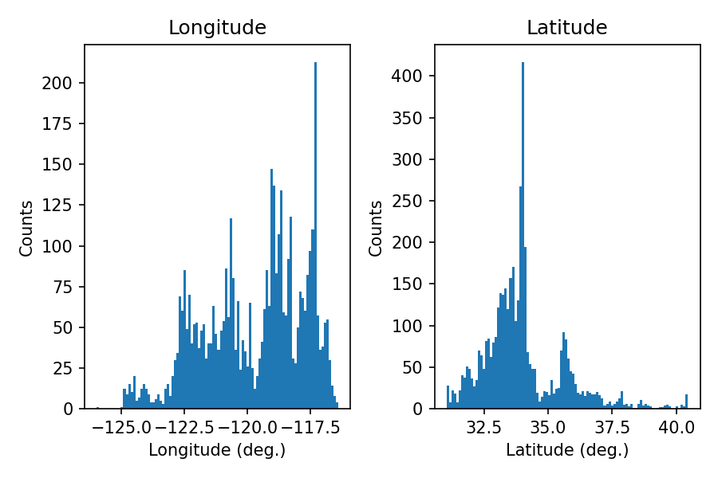
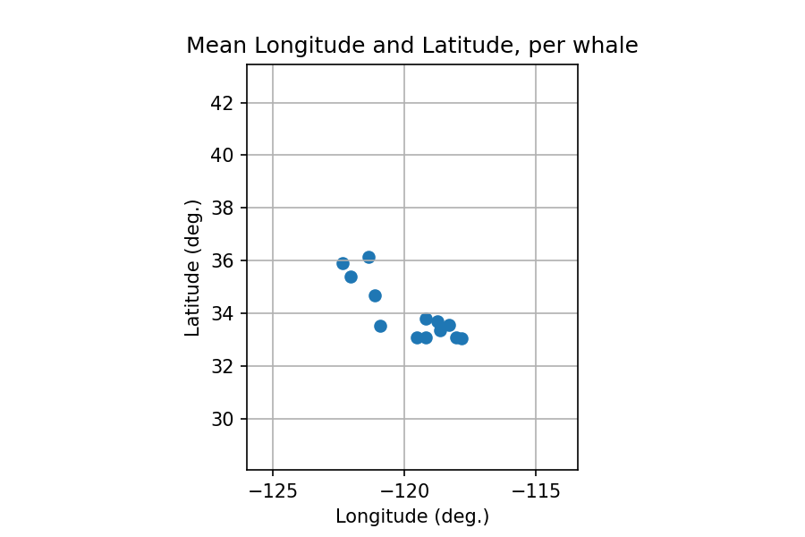

# Example data project

## Q1: Selected data set

This dataset contains GPS trajectories of ~20 whales of the coast of California. The data was downloaded from [https://www.datarepository.movebank.org/handle/10255/move.1065]().

## Q2: Question(s)

Using this data, I want to find out where I am most likely to spot a whale on the West coast.

## Q3: Graphics

 

 

 

## Q4: Conclusions

The West coast varies mostly in latitude. Therefore, the most crucial coordinate to optimize my chances of seeing a whale is the latitude. Both the raw histograms and the average per whale suggest that latitude of about 33 degrees is the sweet spot for whale watching.

## Q5: Code

Code would go here.  